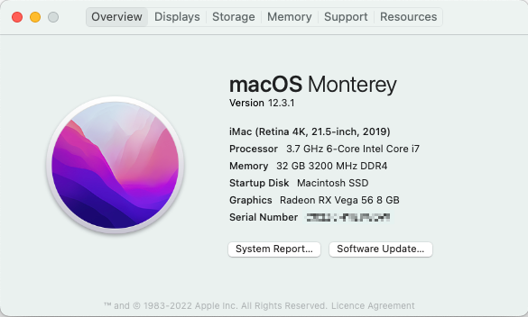
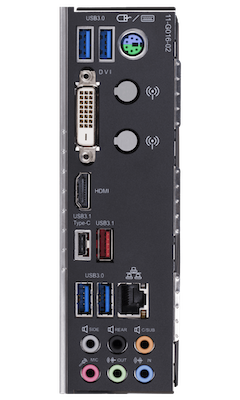
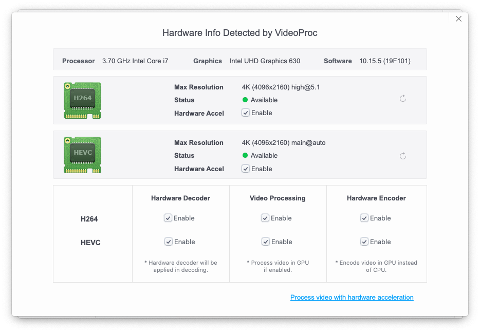

# OpenCore Gigabyte Z390 M Gaming Hackintosh Build

Running macOS Big Sur version `11.2`




## Hardware

Component | Model | Comments
--------- | ----- | --------
Mainboard | Gigabyte Z390 M Gaming, rev. 1.0                        | running Bios F9g 
CPU       | Intel i7-8700k                                          | UHD630 iGPU for compute 
GPU       | Gigabyte RX VEGA 56 GAMING OC 8G                        | works oob
SSD       | WD Black SN750 Gaming 1TB M.2 NVMe                      | works oob
Network   | Broadcom BCM94360CD Wi-Fi & Bluetooth 4.0 PCIe Adapter  | works oob
Memory    | Corsair Vengeance LPX 32GB (2x16GB) 3200MHz             | 


## BIOS

Using the latest, official [F9g](https://www.gigabyte.com/Motherboard/Z390-M-GAMING-rev-10/support#support-dl-bios) bios from Gigabyte.

First load **optimized defaults**, then adjust the following settings:

1. Boot -> CSM Support: **Disabled**
2. Settings -> IO Port -> Internal Graphics: **Enabled**
3. Settings -> IO Port -> Above 4G Decoding: **Enabled**
4. Settings -> IO Port -> USB Configuration -> XHCI Hand-off: **Enabled**
5. Tweaker -> Extreme Memory Profile(X.M.P.): **Profile1**


### Disable CFG-Lock in BIOS

CFG-Lock setting in this bios (`F9g`) is at address `0x5C1`.
Enter the modified _GRUB Shell_ from the OpenCore boot menu and
run the following command to allow MSR 0xE2 to be written to:

```
setup_var 0x5C1 0x00
```

Test CFG-Lock setting with the OpenCore boot menu tool _Check CFG Lock_ (VerifyMsrE2.efi).


## OpenCore Installation Notes

Currently running [OpenCore](https://github.com/acidanthera/OpenCorePkg/releases) `v0.6.6`.

Basically, I just followed the official OpenCore [Coffe Lake Install Guide](https://dortania.github.io/OpenCore-Install-Guide/config.plist/coffee-lake.html).


### USB

USB mapping is done via USBMap.kext injection (generated with the
[USBMap](https://github.com/corpnewt/USBMap) script).

This is my current 15 port mapping:

\# | Device | Type | Postion
-- | ------ | ---- | -------
1 | HS01 | USB 2.0 | back middle right (red port)
2 | HS02 | USB 2.0 | back middle left usb-c
3 | HS03 | USB 2.0 | back top left
4 | HS04 | USB 2.0 | back top right
5 | HS05 | USB 2.0 | back bottom left
6 | HS06 | USB 2.0 | back bottom right
7 | HS07 | USB 2.0 | case front right (via internal header)
8 | HS08 | USB 2.0 | case front left (via internal header)
9 | HS10 | Internal Header (USB 2.0) | used by BCM94360CD Bluetooth adapter 
10 | SS01 | USB 3.0 | back middle right
11 | SS02 | USB 3.0 | back middle left usb-c
x | ~~SS03~~ | ~~USB 3.0~~ | ~~back top left~~
x | ~~SS04~~ | ~~USB 3.0~~ | ~~back top right~~
12 | SS05 | USB 3.0 | back bottom left
13 | SS06 | USB 3.0 | back bottom right
14 | SS07 | USB 3.0 | case front right (via internal header)
15 | SS08 | USB 3.0 | case front left (via internal header)
x | ~~SS10~~ | ~~Internal Header (USB 3.0)~~ | ~~internal bluetooth~~



_Gigabyte Z390 M Gaming IO Backplate_


### iGPU

iGPU works by enabling internal graphics in bios and then using framebuffer `0x3E910003` for [WhateverGreen](https://github.com/acidanthera/WhateverGreen).

**Note:** Make sure you swap bytes when setting the value for `AAPL,ig-platform-id` in config.plist (`0x3E910003` -> `0300913E`).




### Sound

Works with AppleALC.kext using `layout-id 1`.


## Issues

- [ ] Wake from sleep via keyboard or mouse requires a second USB input to completely power on the hackintosh (for example to power on the display).
Check [Keyboard Wake Issues](https://dortania.github.io/OpenCore-Post-Install/usb/misc/keyboard.html) from the OpenCore Post-Install docs.
- [ ] Slow boot time