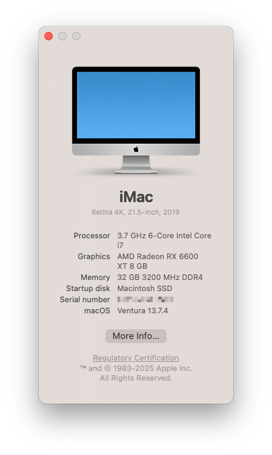

# OpenCore Gigabyte Z390 M Gaming Hackintosh Build

Running macOS Ventura version `13.5`.

## Hardware

Component | Model | Comments
--------- | ----- | --------
Mainboard | Gigabyte Z390 M Gaming, rev. 1.0                        | running Bios F9m 
CPU       | Intel i7-8700k                                          | UHD630 iGPU for compute 
GPU       | Gigabyte AMD Radeon RX 6600 XT                         | works oob
SSD       | WD Black SN750 Gaming 1TB M.2 NVMe                      | works oob
Network   | Broadcom BCM94360CD Wi-Fi & Bluetooth 4.0 PCIe Adapter  | works oob
Memory    | Corsair Vengeance LPX 32GB (2x16GB) 3200MHz             | 

## BIOS

Using the latest, official [F9m](https://www.gigabyte.com/Motherboard/Z390-M-GAMING-rev-10/support#support-dl-bios) bios from Gigabyte.
This is the first bios version which lets you disable CFG-Lock.

First load **optimized defaults**, then adjust the following settings:

1. Tweaker → Extreme Memory Profile(X.M.P.) → **Profile1**
2. Settings → Super IO Configuration → Serial Port → **Disabled**
3. Settings → IO Ports → Above 4G Decoding → **Enabled**
4. Settings → IO Ports → USB Configuration → XHCI Hand-off → **Enabled**
5. Settings → Miscellaneous → Software Guard Extensions(SGX) → **Disabled**
6. Boot → Fast Boot → **Disabled**
7. Boot → CSM Support → **Disabled**
8. Boot → CFG Lock → **Disabled**

## OpenCore Installation Notes

Currently running [OpenCore](https://github.com/acidanthera/OpenCorePkg/releases) `v0.9.3`.

Basically, I just followed the official OpenCore [Coffe Lake Install Guide](https://dortania.github.io/OpenCore-Install-Guide/config.plist/coffee-lake.html).

### USB

USB mapping is done via USBMap.kext injection (generated with the
[USBMap](https://github.com/corpnewt/USBMap) script).

This is my current 15 port mapping:

\# | Device | Type | Postion
-- | ------ | ---- | -------
x | ~~HS01~~ | ~~USB 2.0~~ | ~~back middle right (red port)~~
x | ~~HS02~~ | ~~USB 2.0~~ | ~~back middle left usb-c~~
1 | HS03 | USB 2.0 | back top left
2 | HS04 | USB 2.0 | back top right
3 | HS05 | USB 2.0 | back bottom left
4 | HS06 | USB 2.0 | back bottom right
5 | HS07 | USB 2.0 | case front right (via internal header)
6 | HS08 | USB 2.0 | case front left (via internal header)
7 | HS10 | Internal Header (USB 2.0) | used by BCM94360CD Bluetooth adapter 
8 | SS01 | USB 3.0 | back middle right
9 | SS02 | USB 3.0 | back middle left usb-c
10 | SS03 | USB 3.0 | back top left
11 | SS04 | USB 3.0 | back top right
12 | SS05 | USB 3.0 | back bottom left
13 | SS06 | USB 3.0 | back bottom right
14 | SS07 | USB 3.0 | case front right (via internal header)
15 | SS08 | USB 3.0 | case front left (via internal header)
x | ~~SS10~~ | ~~Internal Header (USB 3.0)~~ | ~~internal bluetooth~~

_Gigabyte Z390 M Gaming IO Backplate_

### iGPU

iGPU works by enabling internal graphics in bios and then using framebuffer `0x3E910003` for [WhateverGreen](https://github.com/acidanthera/WhateverGreen).

**Note:** Make sure you swap bytes when setting the value for `AAPL,ig-platform-id` in config.plist (`0x3E910003` -> `0300913E`).

### Sound

Front and backside ports work with AppleALC.kext using `layout-id 20`.

## Kexts

- AppleALC.kext (https://github.com/acidanthera/AppleALC)
- BlueToolFixup.kext (https://github.com/acidanthera/BrcmPatchRAM)
- IntelMausi.kext (https://github.com/acidanthera/IntelMausi)
- Lilu.kext (https://github.com/acidanthera/Lilu)
- NVMeFix.kext (https://github.com/acidanthera/NVMeFix)
- SMCProcessor.kext (https://github.com/acidanthera/VirtualSMC)
- VirtualSMC.kext (https://github.com/acidanthera/VirtualSMC)
- WhateverGreen.kext (https://github.com/acidanthera/WhateverGreen)
- USBMap.kext ([EFI/OC/Kexts/USBMap.kext](EFI/OC/Kexts/USBMap.kext))

## Issues

None at the moment.
